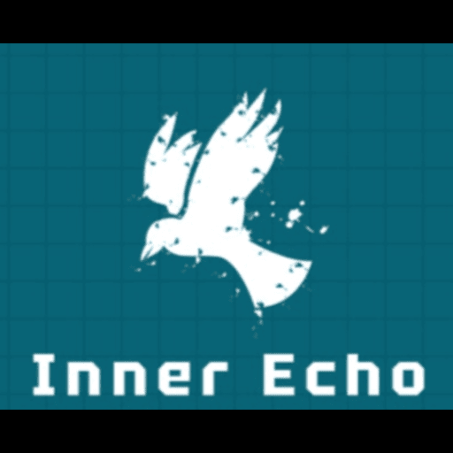

(INNERECHO) Mental Health App

A comprehensive mental health application designed to help users manage their mental wellbeing through various features including mood tracking, journaling, meditation exercises, breathing techniques, and AI-powered support.



## Table of Contents

- [Overview](#overview)
- [Features](#features)
- [Screenshots](#screenshots)
- [Tech Stack](#tech-stack)
- [Project Structure](#project-structure)
- [Installation & Setup](#installation--setup)
- [Usage](#usage)
- [API Documentation](#api-documentation)
- [Contributing](#contributing)
- [License](#license)
- [Contact](#contact)

## Overview

The Mental Health App is designed to provide users with a comprehensive set of tools to support their mental wellbeing journey. The application combines modern UI/UX design principles with evidence-based mental health practices to deliver a seamless and effective user experience.

Our goal is to make mental health support accessible to everyone through technology, providing users with self-help tools that can be used anytime, anywhere.

## Features

### User Profile Management
- Create and manage personalized user profiles
- Track progress and achievements
- Customize app settings and preferences

### Mood Tracking
- Daily mood check-ins and tracking
- Visualization of mood patterns over time
- Identification of triggers and patterns

### Journaling
- Private and secure digital journal
- Guided journal prompts for reflection
- Search and review past entries
- Express thoughts and emotions in a safe space

### Meditation Exercises
- Guided meditation sessions for various needs
- Timer and tracking for meditation practice
- Background ambient sounds
- Progress tracking for meditation habits

### Breathing Exercises
- Guided breathing techniques for stress relief
- Visual breathing guides with animations
- Different techniques for different needs (relaxation, focus, energy)
- Customizable session durations

### Daily Affirmations
- Positive daily affirmations
- Customizable affirmation categories
- Option to create personal affirmations
- Scheduled affirmation reminders

### AI-Powered Chat Support
- 24/7 AI chatbot for immediate support
- Guided conversations for various mental health concerns
- Resource recommendations based on user needs
- Crisis support information and referrals

## Screenshots


## Tech Stack

### Frontend
- **Framework**: Flutter for cross-platform mobile development
- **Language**: Dart
- **State Management**: Provider pattern
- **UI Components**: Material Design
- **Navigation**: Flutter Navigation 2.0
- **Local Storage**: SharedPreferences, SQLite
- **HTTP Client**: Dio

### Backend
- **Framework**: Spring Boot
- **Language**: Java
- **Database**: MongoDB for flexible data storage
- **API**: RESTful API with JSON
- **Authentication**: JWT (JSON Web Tokens)
- **Build Tool**: Maven
- **Deployment**: Docker containerization
- **Testing**: JUnit, Mockito

## Project Structure

The project is organized into two main components:

### Frontend (Flutter)
```
frontend/
├── assets/             # Images, fonts, and other static files
├── lib/
│   ├── main.dart       # Application entry point
│   ├── screens/        # UI screens
│   ├── src/            # Core application code
│   │   ├── app.dart    # App configuration
│   │   ├── localization/  # Internationalization
│   │   ├── settings/   # App settings
│   │   └── sample_feature/ # Feature components
└── test/               # Unit and widget tests
```

### Backend (Spring Boot)
```
backend/
├── src/
│   ├── main/
│   │   ├── java/com/inecho/
│   │   │   ├── controller/  # REST API controllers
│   │   │   ├── model/       # Data models
│   │   │   ├── repository/  # Database access
│   │   │   └── service/     # Business logic
│   │   └── resources/       # Configuration files
│   └── test/               # Unit and integration tests
└── pom.xml                 # Maven configuration
```

## Installation & Setup

### Prerequisites
- Flutter SDK (latest stable version)
- Java Development Kit (JDK) 17 or higher
- Maven
- MongoDB
- Git

### Frontend Setup

1. Clone the repository:
   ```
   git clone https://github.com/yourusername/Mental-Health-App.git
   cd Mental-Health-App
   ```

2. Navigate to the frontend directory:
   ```
   cd frontend
   ```

3. Install dependencies:
   ```
   flutter pub get
   ```

4. Run the application:
   ```
   flutter run
   ```

### Backend Setup

1. Navigate to the backend directory:
   ```
   cd backend
   ```

2. Configure MongoDB connection in `src/main/resources/application.properties`

3. Build the project:
   ```
   ./mvnw clean install
   ```

4. Run the server:
   ```
   ./mvnw spring-boot:run
   ```

### Docker Setup (Optional)

The backend includes a Dockerfile for containerized deployment:

1. Build the Docker image:
   ```
   docker build -t mental-health-app-backend .
   ```

2. Run the container:
   ```
   docker run -p 8080:8080 mental-health-app-backend
   ```

## Usage

1. **User Registration/Login**: Create an account or log in to access personalized features
2. **Profile Setup**: Complete your profile to get personalized recommendations
3. **Daily Check-in**: Track your mood and journal daily for best results
4. **Explore Features**: Try different meditation and breathing exercises
5. **Chat Support**: Use the AI chatbot when you need immediate guidance

## API Documentation

The backend API documentation is available at `http://localhost:8080/swagger-ui.html` when the server is running. This provides a complete reference of all available endpoints, request parameters, and response formats.

Key API endpoints include:
- `/api/users` - User management
- `/api/journal` - Journal entries
- `/api/mood` - Mood tracking

## Contributing

We welcome contributions to the Mental Health App! Please follow these steps:

1. Fork the repository
2. Create your feature branch (`git checkout -b feature/amazing-feature`)
3. Commit your changes (`git commit -m 'Add some amazing feature'`)
4. Push to the branch (`git push origin feature/amazing-feature`)
5. Open a Pull Request

Please ensure your code follows the existing style guidelines and includes appropriate tests.

## License

This project is licensed under the MIT License - see the LICENSE file for details.

## Contact

Project Link: [https://github.com/sv6095/Mental-Health-App](https://github.com/sv6095/InnerEcho)

---

*This application is designed for self-help and is not a replacement for professional mental health care. If you're experiencing a mental health crisis, please contact your local emergency services or a mental health professional.*

